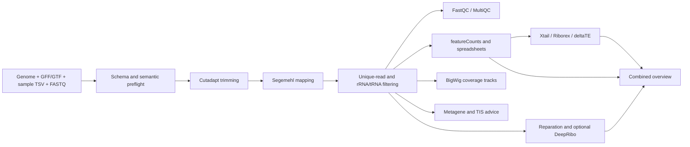

# HRIBO project audit and modernization report

**Audit date:** 2026-09-01

**Audited state:** current working tree, including the unfinished local `2.0.0-dev` stage-selection overhaul

**Overall assessment:** promising pre-release; not ready for a trusted scientific release yet

## Executive summary

HRIBO is a substantial Snakemake workflow for bacterial Ribo-seq analysis. The recent overhaul has improved it considerably: the repository now follows the standard Snakemake layout, requires Snakemake 9, has schema-based preflight validation, has a configurable stage model, has much less duplicated rule code, and has a meaningful Python regression suite.

The current code can build both partial and full DAGs under Snakemake 9.25.2. All 213 Python tests pass. Those are strong foundations.

The workflow is not yet release-ready because several valid configurations either fail late or can silently produce wrong/incomplete results. The most important findings are:

1. deltaTE suppresses its own failures and pre-creates empty outputs, so Snakemake can report a failed analysis as successful.
2. Explicit differential-expression contrasts are ignored by the overview workbook, which can change contrast orientation and omit the requested values.
3. Metagene stop profiles are oriented incorrectly, and global profiles contain empty slices for half of the strand/anchor combinations.
4. The default TIS-advisor stage invokes a script that is not executable in Git.
5. GTF conversion has several crashing and coordinate-corrupting branches.
6. Absolute FASTQ paths are accepted by validation but converted into broken symlink targets.
7. Valid no-prediction DeepRibo results cause a missing-output failure.
8. Mutable containers, model files, and the rolling Swiss-Prot database prevent exact reruns.

The right direction is to preserve the new stage-based architecture, fix correctness before doing more refactoring, add a small workflow-level integration test, lock every environment and external artifact, and then publish the overhaul as a coherent 2.0 release with rebuilt documentation.

## Repository state reviewed

The audit reflects both committed code and the user's current uncommitted overhaul. At audit time the working tree already contained these changes:

- Modified: `ChangeLog.md`, `README.md`, `config/config.yaml`, `tests/conftest.py`, `tests/test_validation.py`, `workflow/Snakefile`, `workflow/rules/common.smk`, `workflow/schemas/config.schema.yaml`, and `workflow/scripts/lib/checks.py`.
- Untracked: `tests/test_stages.py` and `workflow/scripts/lib/stages.py`.

The recent committed overhaul is dated August 2026. The latest Git tag remains `1.8.1`, while the working changelog calls the new version `2.0.0-dev` and `setup.cfg` still says `1.5.0`.

This report did not modify any of those existing files.

## What was verified

| Check | Result | Interpretation |
|---|---:|---|
| `pytest -q` | **213 passed** in 61.89 s | The Python helpers and script-level golden tests are healthy. |
| Python byte compilation | **Passed** | Every file under `workflow/scripts` is syntactically valid Python. |
| YAML parsing | **Passed** | All checked YAML files parse successfully. |
| Shell syntax | **Passed** | `run_hribo.sh` and `slurm_run.sh` pass `bash -n`. |
| `git diff --check` | **Passed** | Existing changes contain no whitespace errors. |
| Snakemake 9.25.2, `stages=mapping` | **Dry-run passed** | A disposable one-library project produced a valid 17-job mapping DAG. |
| Snakemake 9.25.2, shipped default stages | **Dry-run passed** | The current default target set builds a valid DAG. |
| Snakemake 9.25.2, `stages=full` | **Dry-run passed** | A disposable 8-library RIBO/RNA design built the complete DAG, including all three differential-expression tools. |
| Ruff | **Failed: 75 findings** | Mostly cleanup, but includes definite undefined-name defects. |
| `snakemake --lint` | **Failed** | Predominantly missing logs, undeclared execution environments, direct use of global script paths, and rule-structure warnings. |
| Wheel build | **Failed** | `setup.cfg` points to nonexistent `scripts`/`RIssmed` package directories. |

The disposable dry runs also confirmed two edge cases:

- An absolute FASTQ path is rendered as `<working-directory>/<absolute-path>`, producing a broken link.
- An RNA-only metagene run schedules `read_length_statistics.py -a` without any BAM arguments.

### What was not verified

- No complete real-data workflow execution was attempted.
- The 24 Conda environments were not all solved or created from scratch.
- DeepRibo, Reparation, Xtail, Riborex, and deltaTE were not executed inside their production containers/environments.
- SLURM submission was not tested against a cluster.
- Numerical results were not compared against an independent trusted implementation.

Those limitations matter: a successful DAG dry-run validates workflow structure, not the behavior of every external bioinformatics tool.

## Current architecture and functionality



### Inputs and preflight

The workflow expects a nucleotide genome FASTA, a GFF3 or GTF annotation, a tab-separated sample sheet, and gzipped FASTQ files. Supported method tags are `RIBO`, `RNA`, `TIS`, `TTS`, `RNATIS`, and `RNATTS`; paired data use `fastqFile2` ([sample schema](workflow/schemas/samples.schema.yaml#L9-L43)).

Before DAG creation, the Snakefile validates both schemas and runs semantic checks over references, annotation coordinates and identifiers, FASTQ readability, contrasts, and metagene windows ([Snakefile](workflow/Snakefile#L24-L33), [validation entry points](workflow/scripts/validate.py#L28-L73), [checks](workflow/scripts/lib/checks.py#L46-L170)).

### Trimming and mapping

- Single-end and paired-end layouts can coexist in one sample sheet ([trimming rules](workflow/rules/trimming.smk#L1-L59)).
- Cutadapt performs adapter removal, quality trimming, ambiguous-base trimming, and minimum-length filtering ([single-end](workflow/rules/trimming.smk#L62-L79), [paired-end](workflow/rules/trimming.smk#L81-L102)).
- Paired reads are assembled with PEAR and only the assembled single-end output continues through the workflow ([merge rule](workflow/rules/trimming.smk#L104-L123)). Unassembled mates are not mapped.
- Segemehl builds the reference index and maps reads ([mapping rules](workflow/rules/mapping.smk#L1-L39)).
- Reads tagged `NH:i:1` are selected as unique mappings, converted to sorted BAM, and filtered against rRNA/tRNA annotation intervals ([unique selection](workflow/rules/mapping.smk#L41-L69), [structural-RNA filtering](workflow/rules/rrnafiltering.smk#L1-L26)).
- Final BAMs and indexes are exposed under `maplink/` ([target helper](workflow/rules/common.smk#L84-L92)).

### Quality control

The workflow runs FastQC on raw, trimmed, mapped, uniquely mapped, and rRNA-depleted data, generates feature-level structural-RNA summaries, and aggregates them into MultiQC ([QC rules](workflow/rules/qc.smk#L2-L112), [auxiliary QC](workflow/rules/qcauxiliary.smk#L1-L179)).

### Coverage and genome tracks

For every library, the `tracks` stage can generate global, centered, 5-prime, and 3-prime tracks, each with raw, counts-per-million, and minimum-library normalization and separate forward/reverse strands: 24 BigWigs per library ([track definitions](workflow/rules/common.smk#L32-L67), [coverage generation](workflow/rules/visualization.smk#L151-L211)).

Genome-level GFF tracks are produced for ATG starts, alternative starts, stop codons, and the `AAGG` ribosome-binding motif on both strands ([motif rules](workflow/rules/visualization.smk#L26-L84)).

### Annotation and read-count outputs

The workflow converts GTF/GFF to the internal GFF3 representation, enriches child features with parent attributes, generates unambiguous IDs, runs featureCounts against several alignment/annotation combinations, and writes annotation, raw-count, sample, and prediction workbooks ([preprocessing](workflow/rules/preprocessing.smk#L10-L26), [annotation rules](workflow/rules/auxiliary.smk#L13-L109), [generic counting rules](workflow/rules/readcounting.smk#L14-L76)).

### Metagene analysis and TIS advice

RIBO/TIS/TTS libraries receive read-length summaries and profiles around annotated starts/stops across configured mapping and normalization methods ([metagene rules](workflow/rules/metageneprofiling.smk#L3-L73)).

The newer TIS advisor evaluates both read ends, estimates usable read lengths and P-site offsets, and writes HTML, JSON, and TSV evidence ([TIS rule](workflow/rules/metageneprofiling.smk#L76-L124)). Its script-level end-to-end test uses simulated signal with a known planted offset.

### Prediction and downstream analysis

- Reparation predicts ORFs for RIBO libraries using a downloaded Swiss-Prot database, after which predictions are combined, deduplicated, and reannotated ([Reparation](workflow/rules/reparation.smk#L2-L74), [merge path](workflow/rules/merge.smk#L1-L44)).
- DeepRibo is enabled by default. The workflow constructs A-site and coverage tracks, estimates thresholds, runs the containerized model, combines predictions, and writes GFF/Excel output ([DeepRibo](workflow/rules/deepribo.smk#L18-L223)).
- Optional differential-expression/translation analysis runs Xtail, Riborex, and deltaTE per contrast and produces filtered workbooks plus pooled tables ([contrast input](workflow/rules/diffex_contrast.smk#L1-L42), [Xtail](workflow/rules/diffex_xtail.smk#L2-L48), [Riborex](workflow/rules/diffex_riborex.smk#L2-L46), [deltaTE](workflow/rules/diffex_deltate.smk#L15-L95)).
- PCA uses DESeq2-normalized counts and an interactive Plotly presentation; Spearman correlation uses deepTools ([PCA](workflow/rules/pca.smk#L1-L50), [correlation](workflow/rules/visualization.smk#L213-L238)).
- The overview workbook combines annotation, sequence, read counts, predictions, and any enabled differential-expression results ([overview inputs](workflow/rules/common.smk#L294-L326), [overview rule](workflow/rules/auxiliary.smk#L111-L134)).

### Stage selection

The unfinished 2.0 work replaces the old coarse workflow toggle with these target stages:

`trimming`, `mapping`, `qc`, `tracks`, `genome_tracks`, `readcounts`, `metagene`, `tis_advisor`, `correlation`, `pca`, `predictions`, `differential_expression`, and `overview` ([stage resolver](workflow/scripts/lib/stages.py#L13-L49)).

`full` selects all stages; `preprocessing` selects trimming, mapping, and QC. A top-level `stages` command-line override wins over `workflowSettings.stages` ([resolver](workflow/scripts/lib/stages.py#L56-L102)). This is a useful architecture and should be retained.

## What is already improved well

- The repository now uses the standard `workflow/`, `config/`, `rules/`, `scripts/`, `envs/`, `schemas/`, and `report/` structure.
- The workflow is relocatable; rule commands no longer assume a clone named `HRIBO` at a hard-coded path.
- Snakemake 9 is required explicitly, and the SLURM profile uses the executor plugin rather than deprecated `--cluster` behavior ([Snakefile](workflow/Snakefile#L8-L16), [SLURM profile](workflow/profiles/slurm/config.yaml#L11-L30)).
- JSON schemas and the semantic preflight catch many failures before expensive jobs start.
- Generic lookup tables have substantially reduced duplicated coverage, counting, and overview rules ([shared rule helpers](workflow/rules/common.smk)).
- Spreadsheet and GFF output now have golden regression tests.
- Metagene/P-site code has focused unit tests and a simulated TIS-advisor end-to-end test.
- Many recent ordering fixes use explicit stable sorts and deterministic set joins.
- The direct dependency pins were recently refreshed and the remaining legacy version constraints are documented honestly in the environment files.

These are meaningful improvements, not cosmetic changes.

## Confirmed defects

Severity definitions used here:

- **Critical:** can silently claim success with invalid or missing scientific results.
- **High:** breaks a supported/default path or can change scientific values.
- **Medium:** breaks a valid edge case, configuration option, reproducibility, or secondary output.
- **Low:** dormant legacy functionality, diagnostics, or maintainability concern.

### Critical

#### BUG-01: deltaTE failures are silently converted into successful jobs

The deltaTE rule touches all expected result files before running the tool and executes `DTEG.R ... || true` ([diffex_deltate.smk](workflow/rules/diffex_deltate.smk#L44-L61)). Any tool crash, incompatible container, or invalid input can therefore leave empty outputs that satisfy Snakemake.

**Impact:** a workflow can finish successfully while deltaTE contains no valid analysis, and the downstream workbook deliberately accepts empty deltaTE files.

**Fix:** remove `|| true` and the pre-emptive result-file creation. Handle an expected “no result” state explicitly, validate output structure, and use Snakemake `ensure(..., non_empty=True)` where an output must contain data.

### High

#### BUG-02: configured overview contrasts are ignored

`argparse` returns `args.contrasts` as a list, but the overview script tests whether the literal element `","` is in that list. It therefore usually replaces the supplied contrasts with every pairwise condition combination ([generate_excel_overview.py](workflow/scripts/generate_excel_overview.py#L381-L393)).

The golden test currently passes `-c B-A`, but the snapshot contains `A-B` headers, which demonstrates the defect rather than catching it ([test command](tests/test_excel_outputs.py#L57-L70)).

**Impact:** contrast orientation can be reversed, the configured subset is lost, and values keyed by the requested contrast can appear blank under recomputed headers.

**Fix:** use `args.contrasts` directly when it is not `None`; only synthesize pairwise combinations when no contrasts were passed. Add a regression test with one reversed and one omitted contrast.

#### BUG-03: stop metagene profiles are misoriented; global profiles lose data

For stop-codon profiles, plus-strand indices are reversed while minus-strand indices are left in genomic order ([metagene.py](workflow/scripts/lib/metagene.py#L83-L153)). That is the opposite of the expected biological orientation represented by the stop axis `[-positionsInORF, positionsOutsideORF)` ([misc.py](workflow/scripts/lib/misc.py#L75-L92)).

There is a related slicing error: reversed bounds are passed to normal forward Python slices for plus-strand stops and minus-strand starts ([stop global slice](workflow/scripts/lib/metagene.py#L97-L124), [start global slice](workflow/scripts/lib/metagene.py#L52-L79)). The lower index is greater than the upper index, so those global slices are empty.

**Impact:** stop profiles can be mirrored, and global coverage from half of the relevant strand/anchor cases can disappear. This affects scientific interpretation of initiation/termination enrichment.

**Fix:** define one explicit genomic-to-biological coordinate transform per strand and use sorted slice bounds. Add hand-calculated tests for start and stop anchors, both strands, and all four mapping modes.

#### BUG-04: the default TIS-advisor rule cannot execute its script

Git records `workflow/scripts/tis_advisor.py` as mode `100644`, but the rule invokes it directly instead of using Python ([TIS command](workflow/rules/metageneprofiling.smk#L109-L123)).

**Impact:** the shipped default stage selection reaches this rule and fails with `Permission denied` after mapping and metagene prerequisites have run.

**Fix:** either commit the executable bit or, preferably, call the environment's Python explicitly/use a Snakemake `script:` directive. Add a workflow-level smoke test, because the current tests invoke the script through `sys.executable` and cannot catch this.

#### BUG-05: absolute FASTQ paths are turned into broken links

The link rules always prefix the input with `os.getcwd()` ([single-end path](workflow/rules/trimming.smk#L29-L40), [paired paths](workflow/rules/trimming.smk#L42-L57)). An already absolute path such as `/data/read.fastq.gz` becomes `<cwd>//data/read.fastq.gz`.

The audit reproduced this in a Snakemake dry-run. The sample schema and preflight otherwise accept absolute paths.

**Impact:** valid sample sheets using absolute FASTQ paths fail at the first job.

**Fix:** resolve with `Path(input).resolve()` or create links through a small Python function. Quote all paths.

#### BUG-06: GTF conversion has crashing branches and can corrupt child coordinates

The critical-path converter has several independent defects:

- An RNA-only feature without a gene entry references undefined `rna_count` ([gtf2gff3.py](workflow/scripts/gtf2gff3.py#L125-L132)).
- Unknown-only input uses an uninitialized `key`; mixed input can reuse an unrelated previous key ([unknown feature loop](workflow/scripts/gtf2gff3.py#L134-L138)).
- A mixed GFF/GTF diagnostic concatenates a string and a pandas tuple, raising `TypeError` instead of the intended message ([format detection](workflow/scripts/gtf2gff3.py#L145-L163)).
- If neither exact identifier pattern is found, the program exits successfully without creating the requested output ([main branch](workflow/scripts/gtf2gff3.py#L165-L181)).
- When a parent gene exists, CDS and RNA children are written with the parent's start/stop instead of their own coordinates ([child construction](workflow/scripts/gtf2gff3.py#L94-L109)).

The audit directly reproduced the first two exceptions.

**Impact:** accepted annotations can crash conversion, fail obscurely as a missing Snakemake output, or acquire scientifically wrong feature coordinates.

**Fix:** replace this hand-written parser with the shared GFF/GTF parser, preserve each feature's own coordinates, fail explicitly on unsupported/mixed formats, and add fixtures for gene/CDS bounds that differ, RNA-only records, and unknown features.

#### BUG-07: compressed references pass preflight but are copied as uncompressed files

Preflight deliberately reads gzip-compressed references transparently ([validation.py](workflow/scripts/lib/validation.py#L167-L216)), but the preprocessing rules byte-copy them to `genomes/genome.fa` and `annotation/annotation.gff` without decompressing ([preprocessing.smk](workflow/rules/preprocessing.smk#L1-L26)).

**Impact:** validation succeeds, then pandas, Biopython, samtools, or Segemehl sees gzip bytes under a plain-text extension and fails.

**Fix:** either reject compressed reference inputs with a precise preflight error or decompress them in the retrieval rules and test both paths.

#### BUG-08: RNA-only metagene selection schedules an impossible command

When no RIBO/TIS/TTS libraries exist, only prediction/differential/overview stages are removed ([stages.py](workflow/scripts/lib/stages.py#L39-L41), [resolver](workflow/scripts/lib/stages.py#L99-L102)). The metagene stage still unconditionally targets the global read-length report ([Snakefile](workflow/Snakefile#L152-L154)). Its rule therefore expands to an empty BAM list and calls a script whose `-a` option requires one or more values ([rule](workflow/rules/metageneprofiling.smk#L3-L23), [CLI](workflow/scripts/read_length_statistics.py#L160-L170)).

The audit dry-run produced `read_length_statistics.py -a -r 10-80 ...`.

**Impact:** an RNA-only run receives a warning but later fails instead of completing its supported non-Ribo stages.

**Fix:** drop `metagene` and `tis_advisor` when no Ribo-like library exists, or make the read-length target conditional on a nonempty input set.

#### BUG-09: empty DeepRibo results omit a declared output

`filterDeepRibo` declares `deepribo_merged.gff` and `deepribo_merged_plus.gff` ([deepribo.smk](workflow/rules/deepribo.smk#L184-L195)). When its input is empty, the script touches only the main path and never creates the `_plus` path ([merge_duplicates_deepribo.py](workflow/scripts/merge_duplicates_deepribo.py#L165-L175)).

**Impact:** “DeepRibo found no acceptable ORFs” is a valid scientific outcome, but Snakemake reports a missing-output failure.

**Fix:** always write both declared files, with valid headers, and truncate rather than append. Add a zero-prediction integration test.

#### BUG-10: stale prediction rows can survive reruns

- `mergeConditions` appends to an undeclared persistent `{output}.unsorted` file and never truncates it ([merge.smk](workflow/rules/merge.smk#L1-L10)).
- `concatenate_gff.py` opens an existing output in append mode when every input is empty ([concatenate_gff.py](workflow/scripts/concatenate_gff.py#L11-L30)).
- `merge_duplicates_reparation.py` and the empty DeepRibo branch have the same append-without-truncate behavior ([Reparation merge](workflow/scripts/merge_duplicates_reparation.py#L79-L91), [DeepRibo merge](workflow/scripts/merge_duplicates_deepribo.py#L169-L175)).

**Impact:** after inputs change or predictions disappear, old ORFs or duplicate rows can remain in newly reported results.

**Fix:** write atomically to declared temporary outputs, always open final outputs in truncate mode, and remove hidden state from shell rules.

### Medium

#### BUG-11: configured alternative start codons have no effect

The Snakefile reads `alternativeStartCodons` into `CODONS`, but no rule uses it ([Snakefile](workflow/Snakefile#L55-L62)). The track rule always searches `GTG,TTG,CTG`, while the shipped config specifies only `GTG` and `TTG` ([visualization.smk](workflow/rules/visualization.smk#L49-L59), [config](config/config.yaml#L25-L28)).

**Impact:** output contradicts both user configuration and provenance.

**Fix:** pass the configured list to the motif rule and test an unusual valid codon.

#### BUG-12: paired trimmed FastQC processes both mates twice

Both commands in `fastqctrimmed_paired` pass the full `{input}` list instead of `reads1` then `reads2` ([qc.smk](workflow/rules/qc.smk#L61-L83)).

**Impact:** each read is processed twice; leftover outputs can be overwritten, skipped, or moved from a previous invocation depending on FastQC behavior.

**Fix:** call FastQC once with both inputs and move both products, or call it once per named input.

#### BUG-13: empty metagene evidence raises `min()` on an empty list

`equalize_dictionary_keys` computes `min(min(start_list), min(stop_list))` without handling either side being empty ([misc.py](workflow/scripts/lib/misc.py#L101-L127)).

**Impact:** aggressive filtering or low coverage can turn a legitimate “no usable profile” result into a `ValueError`.

**Fix:** return structured empty profiles/warnings or fail with an actionable domain-specific message. Test start-only, stop-only, and fully empty evidence.

#### BUG-14: advertised metagene settings are ineffective or broken

- `lengthCutoff` is parsed but never passed into annotation filtering ([metagene_profiling.py](workflow/scripts/metagene_profiling.py#L77-L120)).
- `pdf` is allowed by the schema and CLI, but the writer handles only PNG, JPG, SVG, and interactive HTML ([schema](workflow/schemas/config.schema.yaml#L207-L217), [writer](workflow/scripts/lib/io.py#L103-L121)).
- A color list with multiple entries is interpolated into `[ ... == nocolor ]` without quoting, which produces an invalid shell test; the default empty list hides it ([metagene rule](workflow/rules/metageneprofiling.smk#L40-L72)).

**Impact:** valid settings are silently ignored or cause runtime failures.

**Fix:** route values through the Python CLI without shell string construction and add a parameterized test for every schema-approved value.

#### BUG-15: malformed annotation rows are collected and then forgotten

`parse_annotation` accumulates malformed line numbers but never reports or returns them ([validation.py](workflow/scripts/lib/validation.py#L237-L297)). If at least one row is valid, preflight can pass while silently discarding bad rows.

**Impact:** features disappear before downstream analysis, or pandas fails later despite a successful preflight.

**Fix:** surface all malformed lines as blocking validation findings.

#### BUG-16: differential-expression preparation does not require matched RIBO/RNA library counts

One condition vector is derived from the RIBO columns ([prepare_diffex_input.py](workflow/scripts/prepare_diffex_input.py#L7-L39)) and reused for RNA in Riborex ([riborex.R](workflow/scripts/riborex.R#L31-L45)). Preflight checks that groups exist, but not that the selected RIBO and RNA table widths match.

**Impact:** unequal replicate designs can be mislabeled or fail inside an old R package.

**Fix:** validate the exact design matrices per tool and either support unequal designs explicitly or reject them before execution.

#### BUG-17: PCA assumes at least three components

The R preprocessing accesses `pca$x[, 1:3]` unconditionally ([analyse_variance.R](workflow/scripts/analyse_variance.R#L77-L92)). The sample schema does not impose enough libraries/features for three components.

**Impact:** small but otherwise valid runs can fail in the default PCA stage.

**Fix:** plot the available number of components or make PCA stage validation enforce its true minimum.

#### BUG-18: Reparation output ordering remains process-dependent

Conditions are expanded from a Python `set` ([merge.smk](workflow/rules/merge.smk#L12-L21)). The downstream Reparation merge preserves dictionary insertion order and never applies a final coordinate sort ([merge_duplicates_reparation.py](workflow/scripts/merge_duplicates_reparation.py#L31-L76)).

**Impact:** identical inputs can produce byte-different GFF ordering despite the recent determinism work.

**Fix:** use the already sorted `conditions` list and sort final records by sequence, start, end, and strand.

#### BUG-19: enrichment has an undefined error-path name

`enrich_annotation.py` calls `sys.exit()` without importing `sys` ([enrich_annotation.py](workflow/scripts/enrich_annotation.py#L15-L28)).

**Impact:** malformed IDs raise `NameError` rather than the intended annotation error.

**Fix:** import `sys` or raise a typed exception consumed by preflight.

### Low or dormant defects

- `annotationBigBed` creates `annotationNScore.bed6`, then reads and redirects a different/nonexistent `annotation.bed6` to itself ([visualization.smk](workflow/rules/visualization.smk#L240-L261)).
- `colorBigWig` consumes legacy `tracks/{library}.fwd/rev.bw` paths for which the current coverage rules have no producer ([visualization.smk](workflow/rules/visualization.smk#L263-L285)).
- The Reparation and PEAR rules declare logs but do not redirect their tools into those logs ([reparation.smk](workflow/rules/reparation.smk#L43-L52), [trimming.smk](workflow/rules/trimming.smk#L113-L123)).
- Metagene output redirection appears after a semicolon, so it creates/truncates the log for an empty command instead of capturing the analysis ([metageneprofiling.smk](workflow/rules/metageneprofiling.smk#L53-L72)).
- Every `contrastInput` job loops over and touches every contrast path, causing overlapping writes and inaccurate job provenance ([diffex_contrast.smk](workflow/rules/diffex_contrast.smk#L1-L9)).

## Architecture and usability gaps

### Partial stages still require unrelated inputs

Validation is unconditional: even `stages=trimming` requires a valid genome and annotation, while `stages=genome_tracks` still validates every FASTQ ([Snakefile](workflow/Snakefile#L24-L33), [validate_inputs](workflow/scripts/validate.py#L58-L73)). That conflicts with the stage model's promise that only dependencies of selected targets matter.

Make validation stage-aware after resolving stages, with explicit input requirements per stage.

### The trimming stage does not retain a consistent trimmed-read deliverable

The stage targets FastQC HTML files only ([common.smk](workflow/rules/common.smk#L133-L171)). Single-end trimmed FASTQ is marked temporary, and the paired assembled output is not a trimming-stage target ([trimming.smk](workflow/rules/trimming.smk#L62-L67), [paired merge](workflow/rules/trimming.smk#L104-L123)).

Either rename the stage to `trimming_qc` or retain the actual trimmed/assembled reads as documented stage outputs.

### The combined updated annotation is implemented but not exposed

Rules can combine predictions with the original annotation into `tracks/updated_annotation.gff`, but no stage requests it ([conditional path](workflow/rules/conditionals.smk), [DeepRibo path](workflow/rules/deepribo.smk#L211-L223), [unite rule](workflow/rules/merge.smk#L46-L55)).

Make it an explicit `annotation`/`predictions` output, or remove the dormant path.

### Script changes are not tracked as job dependencies

Most rules invoke `{SCRIPTS}/...` inside `shell:` without declaring the script as an input ([Snakefile](workflow/Snakefile#L12-L18), for example [read counting](workflow/rules/readcounting.smk#L29-L39)). Editing a script need not invalidate a previously completed result.

Prefer Snakemake `script:` directives or declare every invoked script with `workflow.source_path(...)` as a named input.

### Output paths are not portable

Final BAMs under `maplink/` are absolute symlinks constructed from `os.getcwd()` ([mapping.smk](workflow/rules/mapping.smk#L114-L124)). Moving or archiving a result directory breaks them.

Use relative symlinks, hardlinks, or make the actual BAM the final result.

### Mixed assay conditions are not modeled precisely

Automatic contrasts begin with all conditions in the sample sheet ([Snakefile](workflow/Snakefile#L47-L82)), while the differential tools only use RIBO/RNA columns. TIS/TTS-only conditions can therefore generate irrelevant contrasts or cause feasibility errors ([diffex checks](workflow/scripts/lib/checks.py#L559-L619)).

Derive contrast domains from matched RIBO/RNA groups and validate each requested contrast independently.

## Dependencies, reproducibility, and security

### Legacy runtimes

- Reparation is pinned to Python 3.7 because of `reparation_blast` ([reparation environment](workflow/envs/reparation.yaml)). Python 3.7 reached end of life on 2023-06-27 according to the [official Python version-status table](https://devguide.python.org/versions/).
- Riborex is pinned to R 3.4.1 ([Riborex environment](workflow/envs/riborex.yaml)).
- Xtail is pinned to R 4.0 ([Xtail environment](workflow/envs/xtail.yaml)).
- Kaleido 0.2.1 remains intentionally old to keep a bundled browser on compute nodes ([metagene environment](workflow/envs/metageneprofiling.yaml)).

Short term, isolate these components in versioned, digest-pinned containers and smoke-test them. Long term, repackage/fork or replace the unsupported predictors and statistical packages.

### Mutable scientific inputs

- Swiss-Prot is downloaded from the rolling current path ([reparation.smk](workflow/rules/reparation.smk#L2-L20)).
- The DeepRibo model comes from upstream `master` ([deepribo.smk](workflow/rules/deepribo.smk#L18-L33)).
- DeepRibo and deltaTE use `:latest` container tags ([DeepRibo containers](workflow/rules/deepribo.smk#L83-L149), [deltaTE container](workflow/rules/diffex_deltate.smk#L44-L50)).
- No download checksum is checked.

Identical code and configuration can therefore produce different results on different dates. Pin model commits, select a dated UniProt release, pin images by SHA-256 digest, publish their build recipes, and verify downloads. Docker documents that [digest references are immutable](https://docs.docker.com/reference/cli/docker/image/pull/#pull-an-image-by-digest).

### Conda environments are direct pins, not complete locks

The recent changelog explicitly says package versions were selected from indexes rather than by solving all environments locally. No `*.pin.txt` lock files exist. Exact direct versions still allow transitive dependencies and builds to change.

Solve every environment on each supported platform and generate Snakemake pin files. Snakemake's current [deployment documentation](https://snakemake.readthedocs.io/en/stable/snakefiles/deployment.html) describes explicit environment pinning and containerization.

### Launcher and rule dependency boundaries are incomplete

The Snakefile imports pandas at parse time ([Snakefile](workflow/Snakefile#L1-L33)), while the launcher environment does not list pandas directly ([environment.yaml](environment.yaml#L10-L16)). The local Snakemake environment happened to contain pandas, but HRIBO should declare its own direct parse-time dependency.

Likewise, `checkAnnotation` runs the pandas-dependent converter without a rule environment ([preprocessing.smk](workflow/rules/preprocessing.smk#L19-L26)). Add an explicit environment to the rule.

### Shell interpolation is not hardened

Many user-controlled paths are interpolated without Snakemake's `:q` quoting, including reference copy and FASTQ linking ([preprocessing.smk](workflow/rules/preprocessing.smk#L1-L17), [trimming.smk](workflow/rules/trimming.smk#L29-L57)). Spaces break commands, and shell metacharacters in trusted-but-malformed project input can become command injection.

Use `{input:q}`, `{output:q}`, and quoted params, or avoid the shell for file operations.

## Testing and automation gaps

### Missing continuous integration

There is no `.github/workflows` configuration. Add CI jobs for:

1. `pytest` in an explicit development/test environment;
2. `ruff check` and formatting checks;
3. `snakemake --lint`;
4. schema/config validation;
5. fixture-backed partial and full DAG dry-runs;
6. a small preprocessing/mapping integration run;
7. scheduled environment solves and container smoke tests.

### Tests can silently skip major areas

The runtime environment lists pytest but not all libraries required by tests. Several suites use `pytest.importorskip`, including spreadsheet and TIS end-to-end tests ([spreadsheet tests](tests/test_excel_outputs.py#L17-L23), [TIS test](tests/test_tis_advisor_end_to_end.py#L14-L20)). A green test run can therefore mean a subsystem was skipped.

Create a dedicated test environment and make CI assert the expected collected/tested count.

### Missing workflow-level regression coverage

The current tests exercise scripts and helpers, not Snakemake itself. They do not catch executable bits, rule shell interpolation, undeclared/missing outputs, environment solvability, or command construction.

Reuse `tests/simulate_riboseq.py` to create a tiny workflow fixture and add at least one actual end-to-end stage execution.

### Static-analysis debt

Ruff currently reports 75 findings. Most are unused imports/variables or style, but the report includes the definite `rna_count` and missing-`sys` defects. Configure Ruff in `pyproject.toml`, establish a clean baseline, and make it required in CI.

## Packaging, releases, and documentation

### Packaging is currently broken

The wheel build was reproduced in a disposable copy and failed with:

```text
error: error in 'egg_base' option: 'scripts' does not exist or is not a directory
```

`setup.cfg` maps packages to nonexistent `scripts` and searches nonexistent `RIssmed` ([setup.cfg](setup.cfg#L17-L24)). It would not include the Snakefile, rules, schemas, environments, profiles, or report captions even if discovery succeeded.

Decide whether HRIBO is distributed as:

- a tagged Snakemake workflow through GitHub/WorkflowHub/the Snakemake Workflow Catalog; or
- an installable Python package with PEP 621 metadata, package data, a CLI entry point, and build tests.

Do not advertise `pip install hribo` until that decision is implemented. The [current PyPI release is 1.5.0 from June 2021](https://pypi.org/project/hribo/).

### Version metadata disagrees

- Changelog: `2.0.0-dev` ([ChangeLog.md](ChangeLog.md#L1)).
- Latest Git tag: `1.8.1`.
- `setup.cfg`: `1.5.0` ([setup.cfg](setup.cfg#L1-L4)).
- PyPI: 1.5.0.
- PDF manual: “HRIBO 1.7.0 – Result Guide,” February 2023.
- ReadTheDocs latest: [HRIBO 1.8.0](https://hribo.readthedocs.io/en/latest/).

Use one version source and publish the stage/config migration as a versioned 2.0 release candidate before calling it stable.

### README inconsistencies

- It tells users to name the annotation `annotation.gtf`, but the copied config defaults to `annotation.gff` ([README](README.md#L32-L35), [config](config/config.yaml#L18-L23)).
- It discusses a precomputed STAR index and taxonomic-group setting that no longer exist; the workflow uses Segemehl and annotation-derived structural-RNA intervals ([README](README.md#L45-L47)).
- It uses old `source activate` syntax rather than the supplied environment file ([README](README.md#L14-L18)).
- It does not explain that the default DeepRibo/deltaTE paths require Apptainer.
- It documents only RIBO/RNA single-end rows, while the schema supports additional methods and paired-end input.
- Its SSH clone URL requires a configured GitHub key; an HTTPS example is friendlier.

### Generated documentation is stale or missing

The PDF manual predates the overhaul, and documentation source/configuration is not present in this repository. The linked ReadTheDocs site documents the older configuration and cluster model. The Snakemake report caption also promises result coverage that is not consistently marked with `report()` directives.

Add reviewable documentation source, build it in CI, publish versioned docs, and write a 1.8-to-2.0 migration guide.

## Prioritized modernization roadmap

### Phase 0: protect the overhaul

1. Commit the stage resolver, schema/config changes, tests, README, and changelog as one coherent change.
2. Tag or branch a 2.0 release candidate so later fixes are reviewable in small commits.
3. Record the current expected 213-test baseline.

### Phase 1: correctness blockers

1. Stop deltaTE from masking errors.
2. Fix explicit contrast propagation into the overview.
3. Correct metagene coordinate orientation/slicing and add strand/mode fixtures.
4. Fix TIS-advisor execution mode.
5. Repair or replace GTF conversion and surface malformed rows in preflight.
6. Fix absolute FASTQ paths and compressed-reference behavior.
7. Make empty DeepRibo/Reparation results truncate and produce every declared output.
8. Fix alternative start codon propagation and paired FastQC invocation.

### Phase 2: executable integration baseline

1. Create a complete `environment-dev.yaml`.
2. Add CI for pytest, Ruff, Snakemake lint, schemas, and DAG dry-runs.
3. Run a tiny real preprocessing/mapping workflow in CI.
4. Add zero-read/zero-prediction, RNA-only, paired-end, absolute-path, and explicit-contrast cases.
5. Add container smoke tests outside the fast pull-request job.

### Phase 3: reproducible dependencies

1. Solve every Conda environment on supported Linux platforms.
2. Generate explicit Snakemake pin files.
3. Pin containers by digest and publish Docker/Apptainer recipes.
4. Pin the DeepRibo model and UniProt release with checksums.
5. Retain/cache the expensive Segemehl index rather than marking it temporary.
6. Capture tool/database/model/container versions in the final report.

### Phase 4: simplify and harden

1. Convert direct script shell calls to `script:` or declared script inputs.
2. Quote every shell path and remove hidden intermediate state.
3. Make validation stage-aware.
4. Remove or repair orphan `annotationBigBed`, color-track, and updated-annotation rules.
5. Make final outputs portable rather than absolute symlinks.
6. Add logs and benchmarks to expensive/external-tool rules.

### Phase 5: release and documentation

1. Choose workflow versus Python-package distribution and remove the unsupported alternative.
2. Unify version metadata.
3. Rewrite installation and quick start around `environment.yaml` and Snakemake 9.
4. Rebuild the manual/docs from source and publish a migration guide.
5. Add `CITATION.cff`, contribution/security policies, supported-version policy, and a release checklist.
6. Validate a 2.0 release candidate on at least one representative bacterial Ribo-seq dataset.

## Proposed release gate

HRIBO 2.0 should not be called stable until all of the following are true:

- [ ] All critical and high findings above are fixed or explicitly removed from the supported feature set.
- [ ] Ruff and Snakemake lint have an accepted clean baseline.
- [ ] All Python tests run without optional dependency skips.
- [ ] A partial and full DAG dry-run run in CI.
- [ ] At least one small workflow executes end to end in CI.
- [ ] Every Conda environment solves from scratch and has a pin/lock file.
- [ ] DeepRibo, deltaTE, and other containers are digest-pinned and smoke-tested.
- [ ] External model/database downloads are versioned and checksum-verified.
- [ ] A zero-prediction result completes successfully.
- [ ] Single-end, paired-end, RNA-only, absolute-path, and explicit-contrast fixtures are covered.
- [ ] README, manual, ReadTheDocs, tags, changelog, and distribution metadata agree on the same version and commands.
- [ ] A representative real dataset has been reviewed for biologically plausible results.

## Bottom line

The project is in better shape than its published age suggests. The recent validation, tests, rule deduplication, plotting work, stage model, dependency refresh, and Snakemake 9 migration are solid foundations.

The remaining work is concentrated rather than open-ended: first repair scientific correctness and failure signaling, then put a real workflow execution under CI, then lock the external environment and publish coherent documentation. Once those three layers are addressed, HRIBO can credibly return as a maintainable and reproducible 2.0 workflow.
